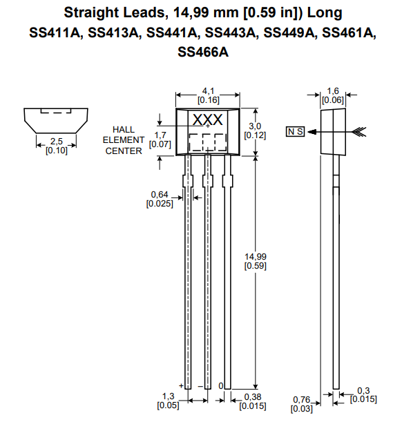

# Speed measurement with a single hall effect sensor

This code allows to estimate the angular speed of the rotor by sampling a single hall effect sensor, which is energized once per rotation.

The angular speed, measured in revolutions per minute, is estimated by measuring the time between ticks (`tbt`) or time between two consecutive `high` samples of the hall effect sensor.

 `angular_speed` (RPM) = 1000 * 60 / `tbt` (ms)

The pinout of the hall effect sensor being used is the following:

Code developed by Sheffield Eco Motorsports.